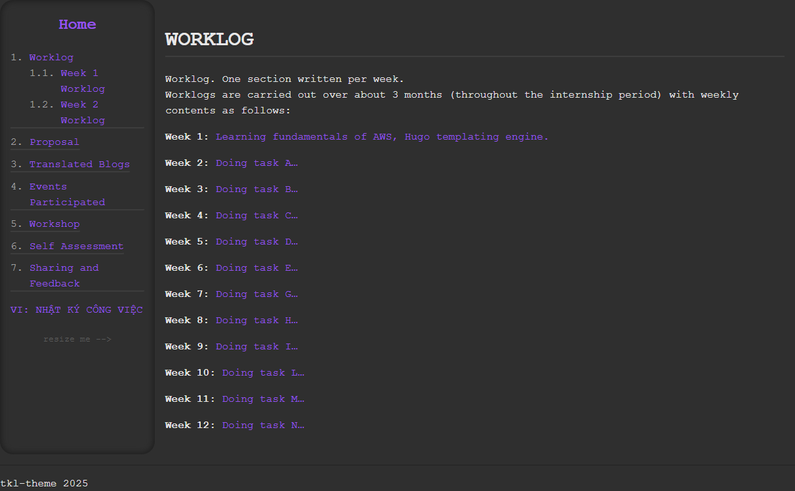

### Mục tiêu Tuần 2

* Tìm hiểu thêm về các dịch vụ AWS.  
* Tạo một giao diện Hugo cho báo cáo cuối cùng.  
* Thu thập ý tưởng cho dự án đầu tiên và bắt đầu sớm.  
* Thiết kế sơ đồ cơ bản cho dự án, phân công mục tiêu cho các thành viên trong nhóm.  

### Nhiệm vụ và Thành tựu

|Nhiệm vụ|Ngày bắt đầu|Ngày hoàn thành|Tài liệu tham khảo|
| --- | --- | --- | --- |
|Tạo theme cho Hugo.|15-09-2025|19-09-2025|https://stackoverflow.com/questions/4098195/can-ordered-list-produce-result-that-looks-like-1-1-1-2-1-3-instead-of-just-1 https://miro.com/app/board/uXjVJGykszQ=/?share_link_id=988177864442 https://discourse.gohugo.io/ |
|Hoàn thành labs: - 000058 Manage Session Logs. - 000019 VPC Peering. - 000020 Transit Gateway. |16-09-2025|16-09-2025|https://cloudjourney.awsstudygroup.com/|
|Hoàn thành labs: - 000010 Hybrid DNS resolution using Route 53. - 000005 RDS. Sử dụng CloudFront Với S3 để host static website. |17-09-2025|17-09-2025|https://cloudjourney.awsstudygroup.com/ https://www.youtube.com/live/lZtHCpXal-c?si=79TLFFSo9xfZGCfG https://tutorialsdojo.com/navigating-dns-management-unveiling-amazon-route-53-inbound-and-outbound-resolver-endpoints/ https://docs.aws.amazon.com/AmazonS3/latest/userguide/WebsiteHosting.html |

#### Về Hybrid DNS

Hybrid DNS cho phép các thiết bị trong VPC phân giải tên miền nội bộ tại hệ thống on-premise và ngược lại.  
AWS hỗ trợ hybrid DNS bằng cách cho phép người dùng tạo cổng Outbound và Inbound với sự trợ giúp của Route 53 Resolver.  
Inbound gateway được sử dụng cho các yêu cầu DNS bắt nguồn từ thiết bị on-premise tới VPC.  
Outbound gateway được sử dụng cho các yêu cầu DNS từ trong AWS VPC tới mạng on-premise.  
Bộ phân giải DNS tích hợp sẵn sẽ dùng địa chỉ IP khả dụng thứ hai. Ví dụ:  
> Mạng 192.168.0.0/24 -> Bộ phân giải DNS 192.168.0.2.

Sự khác biệt giữa Route 53 và Route 53 Resolver:
| R53                  | R53R                           |
|----------------------|--------------------------------|
| Lưu trữ bản ghi DNS  | Phân giải DNS đệ quy           |

#### Giao diện Hugo

Mẫu tôi đã tạo trong tuần này:  

{width="900" height="600"}

Thanh điều hướng có thể thu gọn:  

{width="900" height="600"}
